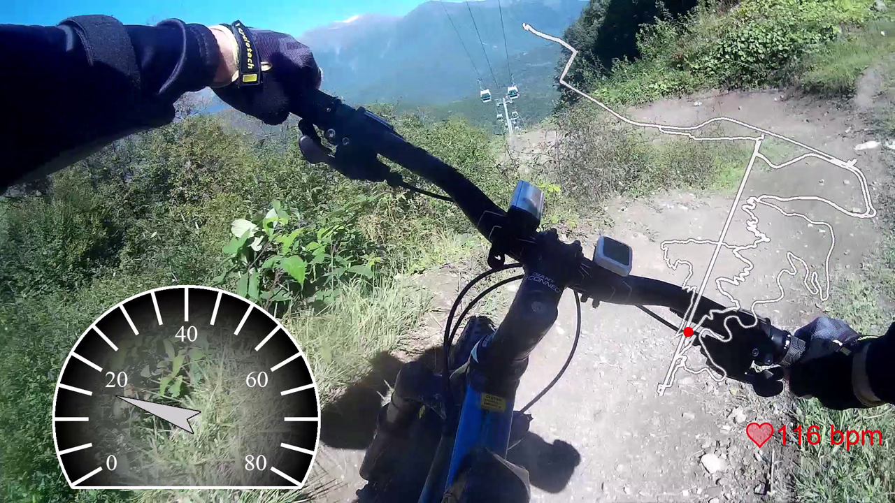
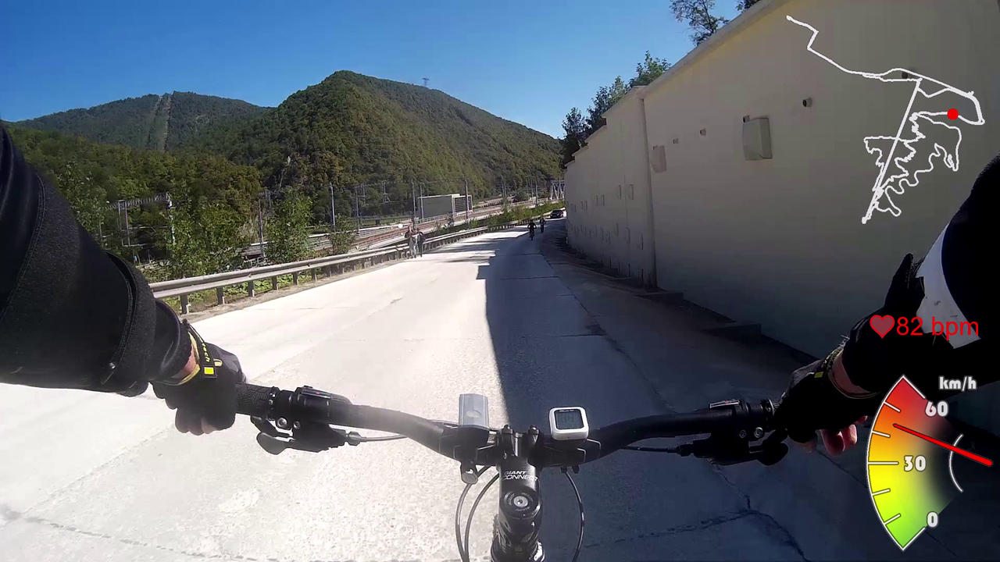

# Strava Overlay Drawer
Pack of tools for drawing Strava-derived telemetry overlay on a video. Commonly used to decorate FPV biking videos. 
Normally your video and your strava telemetry daya are not synchronized, so there is a helper script designed to find the time offset.

The main files you have to care about:
- overlay_drawer.py: The main Overlay Drawer script;
- moment_track.py: Helper script for data synchronization;

The other files are also required of course, but you don't have to run them manually or even look into unless you're going to develop your own widgets. Widgets developing, by the way, is desined to be as easy as possible. Note widges list in the overlay_drawer.py "Settings" section and the widgets base in widgets.py.

Note that the scripts are intended to be ran from an IDE (like Spyder or something like this). These can be called via command line of course, but there are no any command line parameters. Look for the "Settings" sections inside the scripts to configure them before running.

For detailed instructions on data synchronization read "HOW TO USE" comments section in moment_track.py.

Sample shots:

